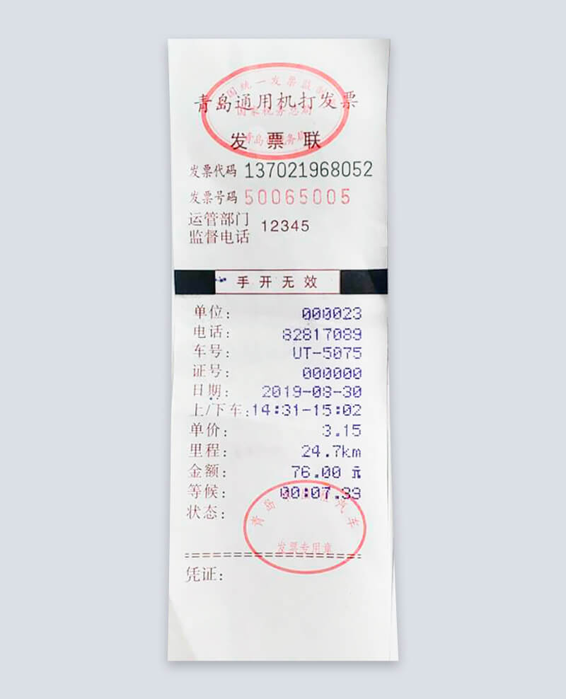
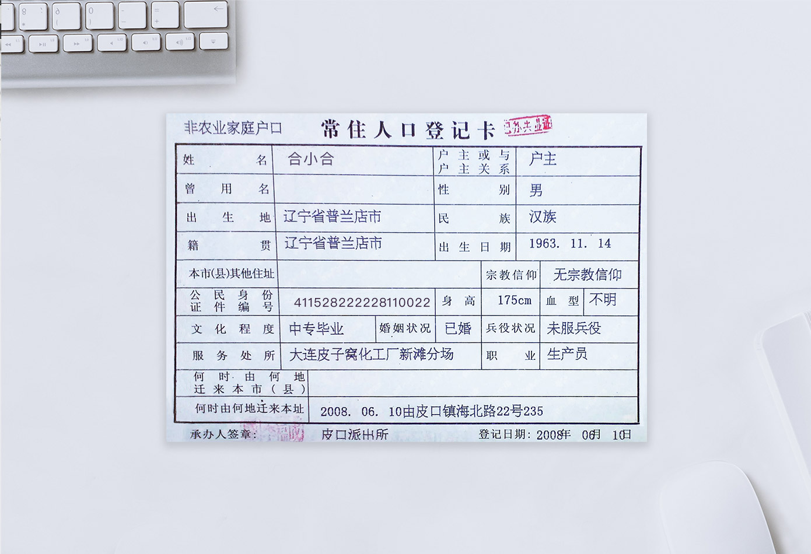

# Key Information Extraction from Image with LLM
# 利用llm大语言模型提取卡证票据关键信息
Basically, it can extract key information from all bills and documents.

> Key information extraction from Image with LLM(large language model)

### Models

- Background subtraction: U2Net
- Text ocr: paddleocr
- KIE: LLM(Here I will use Baichuan2 LLM to test Chinese images)

### LLM Pretrained model

- https://huggingface.co/baichuan-inc//Baichuan2-13B-Chat

### Usage

- main.py

Here, the text recognized by OCR and prompt will be input together into the LLM to extract key information.

### Results Display



```
# key information extraction

invoice_ki = '单位 电话 车号 证号 日期 上／下车 单价 里程 金额'

# results of extraction
{
"单位": "000023",
"电话": "82817089",
"车号": "UT-5075",
"证号": "000000",
"日期": "2019-08-30",
"上/下车": "14:31-15:02",
"单价": "3.15",
"里程": "24.7km",
"金额": "76.00元"
}
```



```
# key information extraction

household_ki = '姓名 出生地 籍贯 出生日期 性别 民族 公民身份证件编号 文化程度 婚姻状况 服务处所 职业 登记日期'
   
# results of extraction
{
"姓名": "合小合",
"出生地": "辽宁省普兰店市",
"籍贯": "辽宁省普兰店市",
"出生日期": "1963.11.14",
"性别": "男",
"民族": "汉族",
"公民身份证件编号": "411528222228110022",
"文化程度": "中专毕业",
"婚姻状况": "已婚",
"服务处所": "大连皮子窝化工厂新滩分场",
"职业": "生产员",
"登记日期": "2008年06月10日"
}

```
### TODO

If you have any good ideas, please let me know and I will try to implement them.

### Reference

- U2Net: https://github.com/xuebinqin/U-2-Net
- PaddleOCR: https://github.com/PaddlePaddle/PaddleOCR
- https://github.com/baichuan-inc/Baichuan2

### contact

- github：https://github.com/jiangnanboy
- blog：https://www.cnblogs.com/little-horse/
- email:2229029156@qq.com
